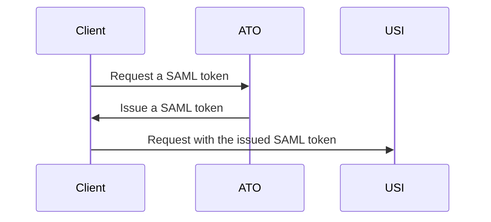

# PHP Sample Application for USI Services

A simple PHP application that demonstrates integration with the **USI Services**.
It provides examples for:

- Calling ATO’s STS to obtain a SAML security token
- Using the obtained token to call the USI Web Service
- Running locally on Windows (`https://windows.usiphp.net`) or Debian‑based Linux (`https://linux.usiphp.net`)

---

## 📦 Prerequisites

### Windows

- PHP 8.x+ installed
- IIS feature enabled
- [CGI feature](https://learn.microsoft.com/en-us/iis/configuration/system.webserver/cgi) enabled
- [URL Rewrite module](https://www.iis.net/downloads/microsoft/url-rewrite) installed
- [PowerShell 7+](https://learn.microsoft.com/en-us/powershell/scripting/install/installing-powershell-on-windows)

### Debian‑based Linux

- PHP 8.x+ installed
- [Apache](https://httpd.apache.org/) installed
- [libapache2-mod-php](https://packages.debian.org/sid/libapache2-mod-php) installed

---

## ⚙️ Local Development Setup

### Windows (IIS)

Run the setup script with admin privileges:

```powershell
.\deployment\setup-local-windows.ps1
```

Get help for parameters:

```powershell
Get-Help ".\setup-local-windows.ps1" -Full
```

Additional notes:

- Download [XDebug binaries](https://xdebug.org/download) → place in `<PHP installation directory>\ext` and rename to `php_xdebug.dll`.
- Ensure the `scriptProcessor` attribute in [web.config](src/web.config) points to your PHP installation path (default: `C:\PHP\php-cgi.exe`).

---

### Debian‑based Linux

Run the setup script:

```bash
sudo ./deployment/setup-local-debian.sh "path/to/src"
```

- The `path/to/src` parameter is optional.
- Default path: `<script file directory>/../src`.

---

## 🔀 Sequence Diagram



## 🧪 Testing Accounts

Two test accounts are available:

- **VA1802** → Example for _ActAs_ delegation
  - First party: `11000002568`
  - Second party: `96312011219`
- **VA1803** → Example for common cases

See [keystore-usi.xml](./src/assets/configuration/Development/keystore-usi.xml) for machine account settings.

---

## 🐛 Issues & Support

- Raise bugs, requests, or discussions on [GitHub Issues](../../issues).
- For security concerns, please see [SECURITY](SECURITY.md).
- For general support, contact **it@usi.gov.au** or see [SUPPORT](SUPPORT.md).

---

## 📚 Additional Notes

- The sample is intended for **development and testing only**; do not use test accounts in production.
